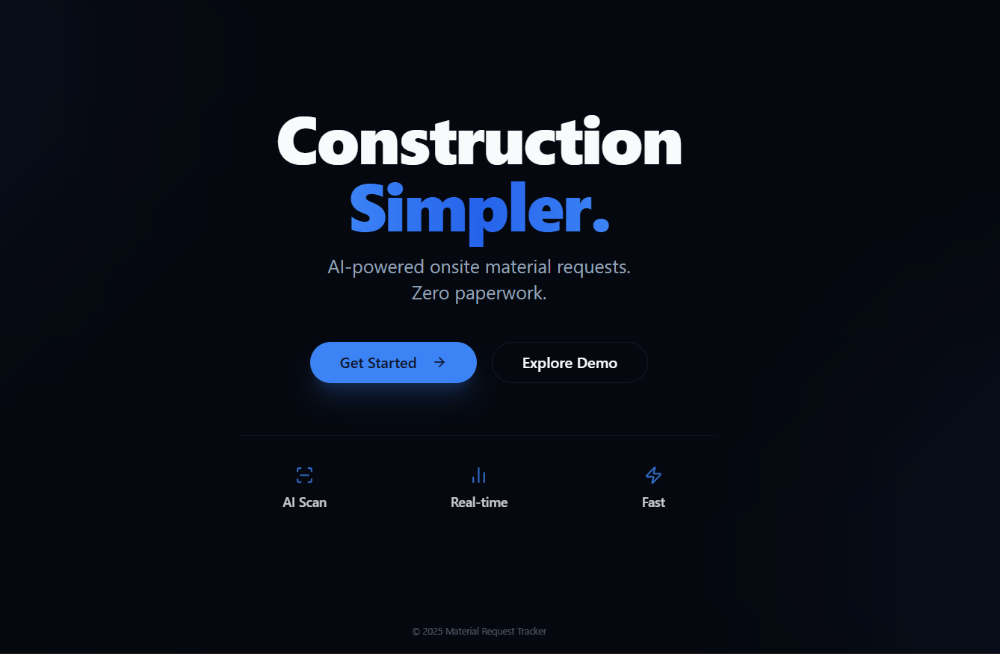
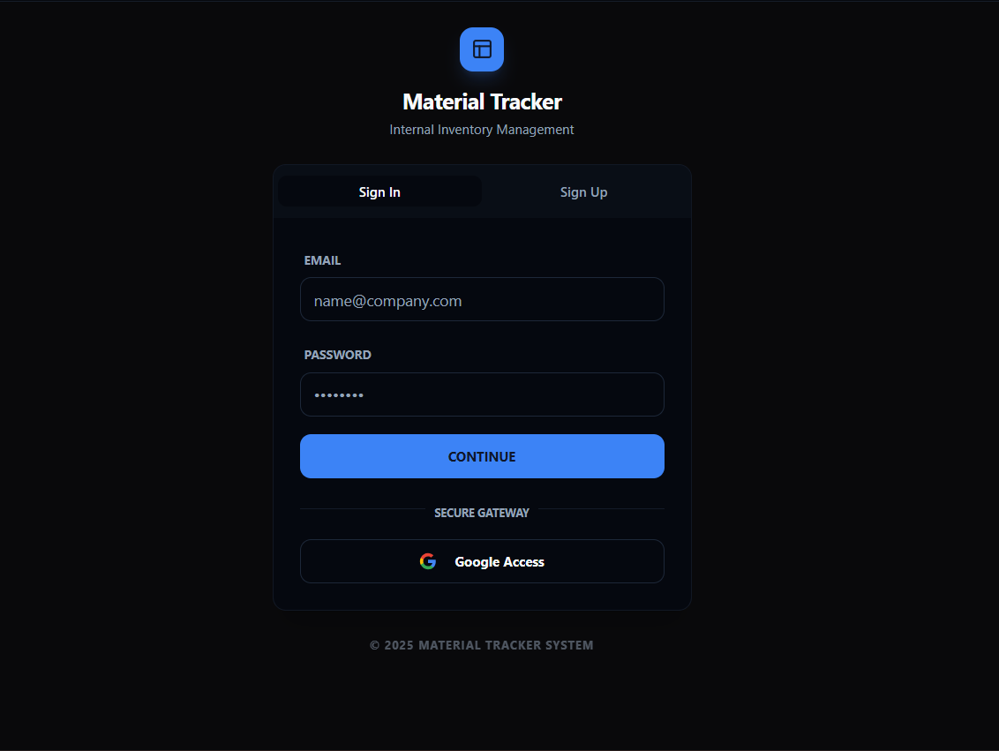
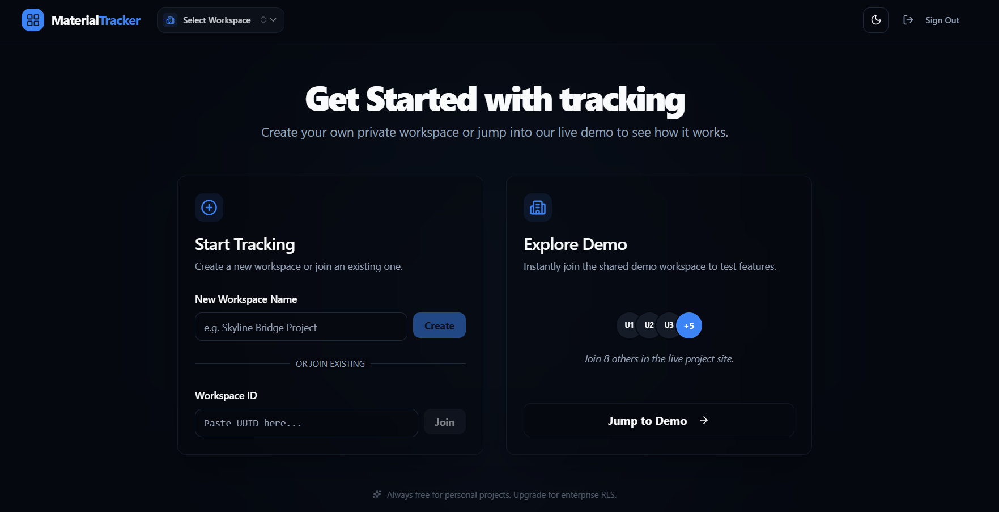
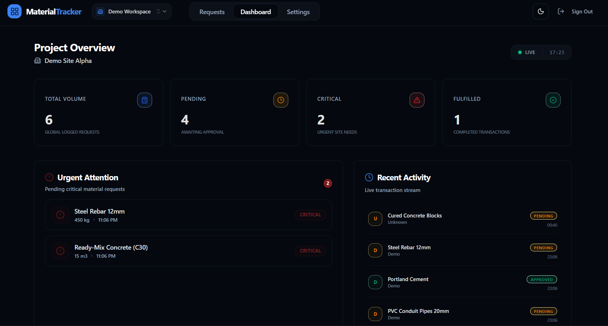
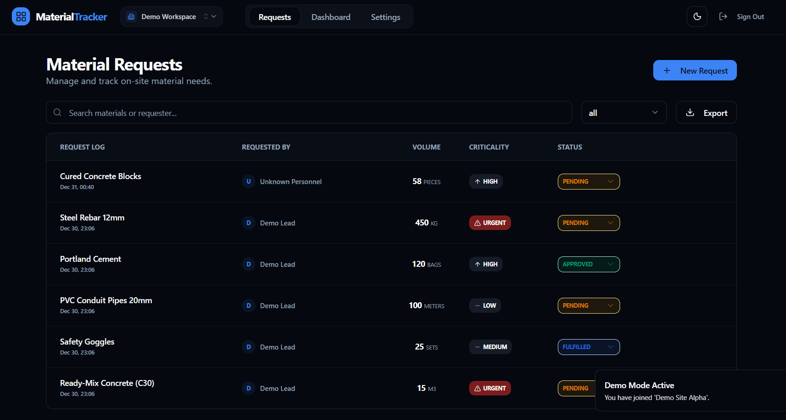
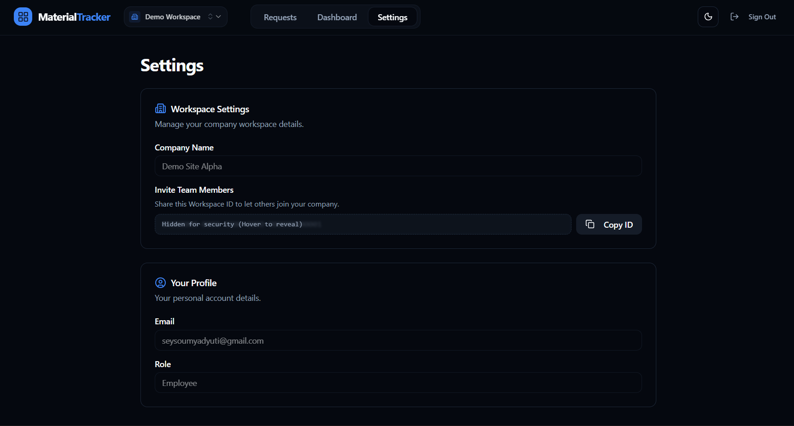

# Material Request Tracker

A professional, compliant, and AI-enhanced material procurement platform built for the modern construction site. This application allows site personnel to request materials, tracks approval lifecycles, and utilizes Generative AI for automated data entry from documents.

**Live Demo URL**: [https://material-tracker-chi.vercel.app/](https://material-tracker-chi.vercel.app/)

## Visual Walkthrough

### 1. Landing & Authentication


**Landing Page**: Modern entry point for the application.


**Secure Login**: Supabase-powered authentication.

### 2. Onboarding & Dashboard


**Company Setup**: Seamless multi-tenancy onboarding.


**Dashboard**: Real-time overview of request statuses and metrics.

### 3. Core Features & Settings


**Material Request Hub**: Centralized table with filtering, search, and status management.


**Settings**: User profile and company configuration.

---

## Quick Start

### 1. Prerequisites
- Node.js 18+
- Supabase Project
- Vite

### 2. Environment Setup
Create a `.env` file in `apps/web`:
```env
VITE_SUPABASE_URL=your_supabase_project_url
VITE_SUPABASE_ANON_KEY=your_supabase_anon_key
VITE_GEMINI_API_KEY=your_google_gemini_api_key
```

### 3. Installation & Run
```bash
# Install dependencies
npm install

# Start development server
cd apps/web
npm run dev
```

---

## Database Setup (Supabase)

Run the following SQL in your Supabase SQL Editor to initialize the schema and security policies.

### Schema Migration
```sql
-- Enable UUID extension
CREATE EXTENSION IF NOT EXISTS "uuid-ossp";

-- 1. Companies & Profiles (Multi-tenancy Base)
CREATE TABLE IF NOT EXISTS companies (
    id UUID PRIMARY KEY DEFAULT uuid_generate_v4(),
    name TEXT NOT NULL,
    created_at TIMESTAMP WITH TIME ZONE DEFAULT NOW()
);

CREATE TABLE IF NOT EXISTS profiles (
    id UUID PRIMARY KEY REFERENCES auth.users(id) ON DELETE CASCADE,
    company_id UUID REFERENCES companies(id),
    full_name TEXT,
    role TEXT DEFAULT 'employee',
    created_at TIMESTAMP WITH TIME ZONE DEFAULT NOW()
);

-- 2. Material Requests Table
CREATE TABLE IF NOT EXISTS material_requests (
    id UUID PRIMARY KEY DEFAULT uuid_generate_v4(),
    company_id UUID REFERENCES companies(id) NOT NULL,
    requested_by UUID REFERENCES profiles(id) NOT NULL,
    material_name TEXT NOT NULL,
    quantity NUMERIC NOT NULL,
    unit TEXT NOT NULL,
    priority TEXT CHECK (priority IN ('low', 'medium', 'high', 'urgent')) DEFAULT 'medium',
    status TEXT CHECK (status IN ('pending', 'approved', 'rejected', 'fulfilled')) DEFAULT 'pending',
    notes TEXT,
    requested_at TIMESTAMP WITH TIME ZONE DEFAULT NOW(),
    updated_at TIMESTAMP WITH TIME ZONE DEFAULT NOW()
);

-- 3. Row Level Security (RLS) Policies
ALTER TABLE material_requests ENABLE ROW LEVEL SECURITY;

-- Allow users to view requests ONLY from their company
CREATE POLICY "View Company Requests" ON material_requests
    FOR SELECT USING (company_id = (SELECT company_id FROM profiles WHERE id = auth.uid()));

-- Allow users to create requests for their company
CREATE POLICY "Create Company Requests" ON material_requests
    FOR INSERT WITH CHECK (company_id = (SELECT company_id FROM profiles WHERE id = auth.uid()));

-- Allow users to update status (updates are restricted to company)
CREATE POLICY "Update Company Requests" ON material_requests
    FOR UPDATE USING (company_id = (SELECT company_id FROM profiles WHERE id = auth.uid()));
```

---

## Technical Approach & Decisions

### Architecture
- **Monorepo Structure**: Organized into `apps/web` for the frontend application logic.
- **Feature-Based Folder Structure**: Code is grouped by domain (`features/requests`, `features/auth`) rather than type, making the codebase scalable and navigable.

### Feature Breakdown

**1. Material Request List (`/material-requests`)**
*   **Table View**: Displays all requests with columns for *Material Name, Quantity, Unit, Status, Priority, Requested By, and Date*.
*   **Filtering**: Implemented via a Dropdown for *Status* and a Search Bar for *Name/Requester*.
*   **Export**: CSV export feature included as a bonus over-deliverable.

**2. Create/Edit Forms**
*   **Create Form**: Validated using `react-hook-form` and `zod`.
*   **Edit Form**: The current implementation supports updating full request details via a side sheet (Drawer). This allows for correcting errors or updating information as needed.

**3. Status Update**
*   **Mechanism**: A dropdown directly in the table row allows quick state changes (`pending` → `approved`).
*   **Safety**: A confirmation dialog intercepts critical changes.
*   **Performance**: Uses **Optimistic UI Updates** via React Query.

### Key Decisions
1.  **AI Integration (The "AI Twist")**:
    - Implemented `Gemini 1.5 Flash` for identifying materials from images.
    - **Resilient AI Strategy**: Uses a fallback mechanism to ensure high availability.
    - **Client-Side Compression**: Images are compressed in the browser before sending to AI.
2.  **UI/UX Polish**:
    - Used **Shadcn UI** for a consistent, accessible design system.
    - **No Emojis**: Replaced with professional Lucide icons.
    - **Responsive**: Fully mobile-responsive design with custom navigation.
3.  **Strict TypeScript**:
    - Ensured strict typing for core business logic.
    - *Note*: Some UI component primitives (Radix UI wrappers) use pragmatic type casting to ensure compatibility with React 19 pending official library updates.

---

## How It Works (Deep Dive)

### Optimistic UI Updates
Instead of waiting for the server to reply "OK", we update the UI **instantly**.
1.  User changes status → `pending` to `approved`.
2.  `React Query`'s `onMutate` cancels outgoing refetches and snapshots the current list.
3.  We artificially inject the new status into the cache. **The user sees the change immediately.**
4.  We send the API request in the background.
    *   *If success*: nothing else happens (silent sync).
    *   *If error*: we rollback to the snapshot (toast error appears).

### AI Document Scanner
We not only meet the requirements but over-deliver with a "Smart Scan" feature:
1.  **Compression**: The browser resizes images to max 1024px to save bandwidth.
2.  **Strategy Pattern**: We make a call to Google Gemini's multimodal API.
3.  **Prompt Engineering**: A structured system prompt forces the AI to return **pure JSON**, which we then parse and populate directly into the form fields.

---

## Testing & Validation

The application utilizes **React Query** for robust server state management, handling caching, deduping, and background updates automatically.

- **Linting**: Standard ESLint configuration.
- **Type Checking**: Strict `tsc` validation.
- **Build**: Vite production build system.

---

*Built for the coding assignment.*
